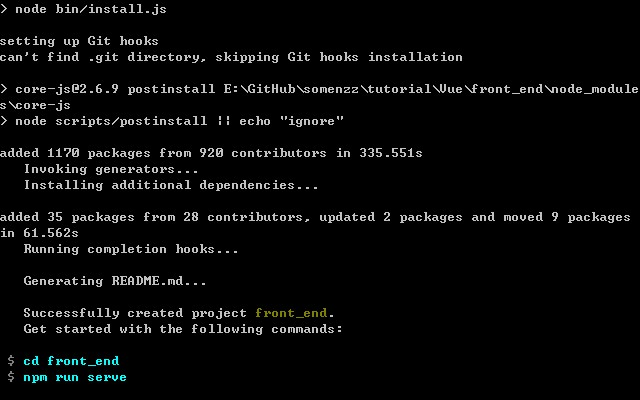
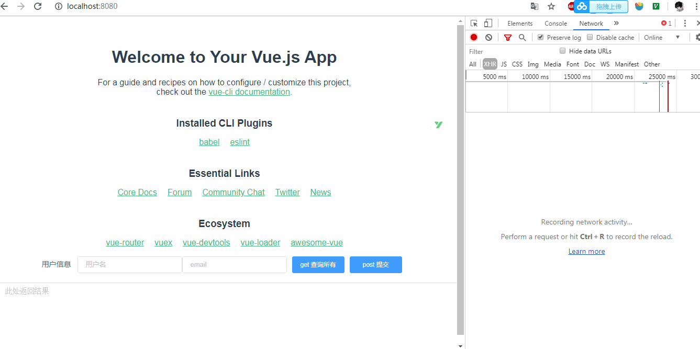
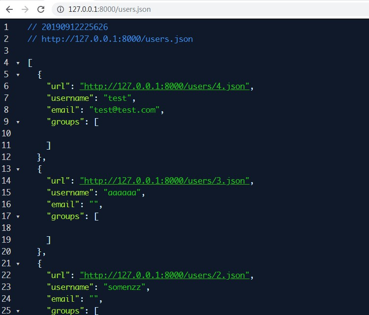
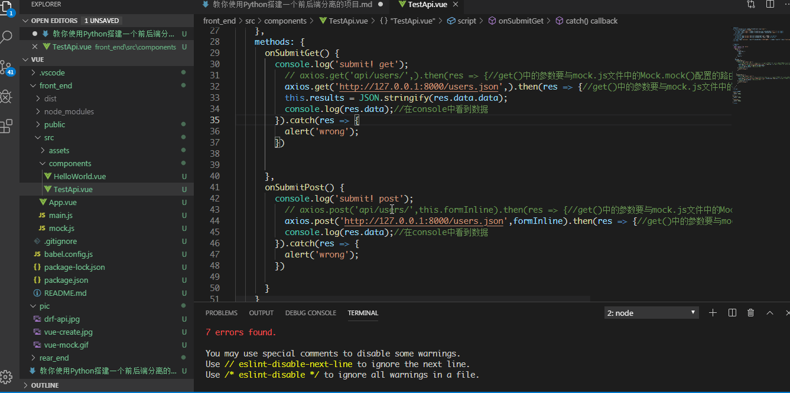
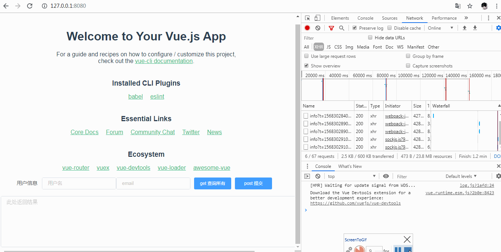
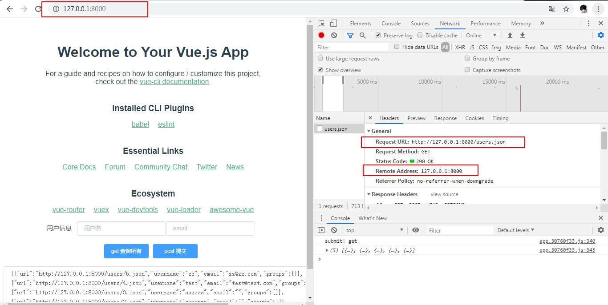

本文教你玩转 django 及 vue。 有问题请关注公众号 somenzz ，后台留言交流。


#### 前后端完全不分离

在 5 年前，前后端还是几乎是不分离的，web 开发中的代码尤其混杂，PHP 中有 JS，JSP 中有 JS，ASP 中有 JS，JS 中有 HTML，HTML 中有 CSS，HTML 中还有 JS，各种标签代码一锅粥，数据在各处流窜，眼花缭乱，极难维护。

比如这样一段包含模板标签的 html 代码：

```html
<!--服务器端渲染 -->
<select>
    <option value=''>--请选择所属业务--</option>
    
    <option value="{{ p }}">{{ p }}</option>
    
</select>
```
不去后端查代码，你无法知道 p\_list 是何种对象，有何属性。

这种开发方式的问题越来越严重：
1、性能下降：由于网页全部由服务端渲染，每次刷新都需要服务器返回整个网页的内容，性能下降，给用户的体验就是慢，卡。
2、维护越来越困难：各种代码混在一起，可读性极差，耦合度极高，改动一处可能会引发灾难。
3、效率下降：一个人精力有限，很难精通所有语言，精通 javascript 的可能不会 Python，反之亦然，因此开发时需要临时再学习新知识，效率下降。

#### 前后端半离不离

AJAX 的出现，让网页局部刷新成为可能。这一特性可以让用户留在当前页面中，同时发出新的HTTP请求，数据却可以不断地更新。解决了服务器每次请求都返回整个网页这种低效的机制。最早大规模使用 AJAX 的就是 Gmail，Gmail 的页面在首次加载后，剩下的所有数据都依赖于 AJAX 来更新大大提升了响应速度。也就是解决了上述问题 1。

虽然有 AJAX ，但大多数的页面还是有服务器端渲染的，也就是前后端半离不离的阶段，这仍然无法解决上述问题 2 和问题 3。

#### 前后端彻底分离

后来随着前端技术的飞速发展，浏览器的不断迭代，前端 MVC 框架应运而生，如 React、Vue、Angular ，利用这些框架，我们可以轻松的构建起一个无需服务器端渲染就可以展示的网站，同时这类框架都提供了前端路由功能，后台可以不再控制路由的跳转，将原本属于前端的业务逻辑全部丢给前端，这样前后端分离可以说是最为彻底，生成的代码的可读性和维护性都得到相应提高。如下面的一段代码：

```html
<!--前端渲染 -->
<template>
    <select id="rander">
        <option value=''>--请选择所属业务--</option>
        <option v-for="list in lists" :value="list" v-text="list"></option>
    </select>
</template>

<script>
export default {
    data: {
        return {
            lists: ['选项一', '选项二', '选项三', '选项四']
        }
    }，
    ready: function () {
        this.$http({
            url: '/demo/',
            method: 'POST',
        })
        .then(function (response) {
            this.lists = response.data.lists // 获取服务器端数据并渲染
        })
    }
}
</script>
```

说到这里，什么是前后端分离，有一个简洁的判断标准：第一次在浏览器中输入网址请求服务器，此时服务器返回一个 html 页面，即首页，一般是 index.html，在后续的请求中，只要服务器端返回 html 页面，就不是前后端分离，只要服务器返回的是纯数据，就是前后端分离，跟所用的语言，框架，没有任何关系。

前后端彻底分离带来的优点是显而易见的：

1.提高工作效率，分工更加明确

前后端分离的工作流程可以使前端只关注前端的事，后台只关心后台的活，两者开发可以同时进行，在后台还没有时间提供接口的时候，前端可以先将数据写死或者调用本地的json文件即可，页面的增加和路由的修改也不必再去麻烦后台，开发更加灵活。

2.局部性能提升

通过前端路由的配置，我们可以实现页面的按需加载，无需一开始加载首页便加载网站的所有的资源，服务器也不再需要解析前端页面，在页面交互及用户体验上有所提升。

3.降低维护成本

通过目前主流的前端 MVC 框架，我们可以非常快速的定位及发现问题的所在，客户端的问题不再需要后台人员参与及调试，代码重构及可维护性增强。


#### 前后端分离但并不分家 

前后端虽然分离，但对团队分家，分成前端团队和后端团队却未必是最合适的。分离的目的是减少沟通过程中信息的损耗，如果分成两个团队，沟通成本仍然会增加。通常的作法是一个团队里即有前端开发者，又有后端开发者，一开始大家都专注自己份内的事情，无需经常沟通，只需要最后前后端接口联调时需要对接一次。
前后端分离的好处是：彼此的分工非常明确，专注于自己最擅长的事情。

你可能会问了，我就一个人，在 web 开发时，是否也搞前后端分离？ 

我的回答是，要的，这是一种良好的工程实践，使你的写前端时专注前端设计，写后端时专注后端数据，减少大脑在前后端切换的能量损耗，这会使你开发更轻松，更高效，更少 bug。

#### 为什么要学点前端

前后端分离是一种必然趋势，前端慢慢地发展为大前端，前端工程师的作品直接面向用户，用户的体验好不好，直接决定产品的生死存亡，越来越多的公司开始重视前端开发，结果就是前端薪资的不断提升。相反后端工程师就是默默付出，没有前端的展示，一堆枯燥的数据好像并不能引起人们的兴趣，你写的代码性能好是应该的，性能差就被骂死，功劳好像都被前端抢走了。

那么，后端如何体现自己的价值呢？ 在适当的时候展示自己的实力即可，如何展示？ 还是需要借助 web 这种互联网工具，别人想看看你的数据，你二话不说，直接给他一个你做的网站的 url 链接，一打开就有良好的数据展示和交互，想象一下对方惊呼牛逼时自己的心情吧。

或者你想开发一个效率工具给大家用，web 开发都是最好的方式。

学习前端，可以更好的理解网站、浏览器的工作机制，爬虫原理，也可以发现其他网站的一些漏洞，bug，完善自己的编程知识体系。

另外，学会前端可以自己建站获取流量，帮别人建站获取报酬，收获都是非常大的。

因此，我建议后端工程师学点前端知识，不求精通，至少可以使用前端技术栈为自己服务。


#### DjangoRestFramework + Vue 前后端分离环境搭建

说了这么多，来点硬货吧。什么是 REST API，可以看看阮一峰老师的博客上的[解释](http://www.ruanyifeng.com/blog/2014/05/restful_api.html)，这里就不啰嗦了。

DjangoRestFramework 是 Python 里开发 REST API 最好用的库，没有之一，当然这是我自己的观点，如果你不授受，就让我接受你的，在后台给我留言。

什么是 Vue ，为什么要学 Vue，因为 Vue 是一个轻量级，渐进式的前端框架，有非常活跃的社区和生态，学习成本低，开发效率高，随学随用，易于理解。

如何使用 Vue，如何使用 DjangoRestFramework，官方都给出了教程，还有示例代码，但两者结合起来讲的，网上也有，但都是只讲操作，不讲原理，有的按照其做了，还行不通。今天我把两者官方的示例拿出来，再完整地搭建一个前后端分离的开发环境，并分享一下某些步骤这样做的缘由，希望能帮助到你。

这里不会对每一个步骤都做详细陈述，因为官方网站都为你准备好了，照着去做就行。

先按官方网站上的教程自己先做一个 demo

###### 来一个前端 demo

vue-cli 是 Vue 的脚手架工具，功能非常强大，官方链接： [https://cli.vuejs.org/zh/](https://cli.vuejs.org/zh/)

1、先安装 Node.js 8.9 或更高版本，然后再使用 npm 安装 vue-cli：


```
npm install -g @vue/cli
```
你就可以在命令行中访问 vue 命令。你可以通过简单运行 vue，看看是否展示出了一份所有可用命令的帮助信息，来验证它是否安装成功。


2、创建一个前端项目

命令窗口执行 vue create front_end ,选默认配置，等待其安装完依赖的包即可。成功后，你会看到以下提示：



执行

```cmd
 cd front_end
 npm run serve
```
就可以看到在端口 8080 已经启动了 web 服务。打开浏览器输入 http://localhost:8080/ 即可访问到 vue 项目的默认界面。


3、安装 element-ui ,axios, mockjs

element-ui 是 vue 的一个 ui 库，引入它主要为了使用一些好看的按钮，表单，文本框等，可以替换你喜欢的 ui 库，也可以不用。

axios 类似于 AJAX 的功能，主要为了访问后端 api 来获取数据。

mockjs 主要用于模拟后端的 api 接口返回数据。当前端工程师需要独立于后端并行开发时,后端接口还没有完成,那么前端怎么获取数据？ 这时可以考虑前端自己模拟假数据,mockjs 可用来生成随机数据，拦截 Ajax 请求。

安装方法同样使用 npm，如下所示

```
npm i element-ui -S
npm i axios -S
npm i mockjs -S
```

4、修改 main.js ，全局引入 element-ui，并使用 mockjs 模拟接口数据

```javascript
mport Vue from 'vue'
import App from './App.vue'
import ElementUI from 'element-ui';
import 'element-ui/lib/theme-chalk/index.css';
require('./mock');
Vue.config.productionTip = false
Vue.use(ElementUI);

new Vue({
  render: h => h(App),
}).$mount('#app')
```
这里我是一步一步安装的，直接下载源码的朋友，请在 package.json 所在的目录执行 npm install 即可自动安装所有的依赖包。

5、在 components 目录下新建一个 TestApi.vue 的文件，写入以下内容：

```javascript
<template>
<el-form :inline="true" :model="formInline" size="small" >
  <el-form-item label="用户信息">
    <el-input class="input" v-model="formInline.username" placeholder="用户名"></el-input>
    <el-input class="input" v-model="formInline.email" placeholder="email"></el-input>
  </el-form-item>
 <el-form-item>
    <el-button type="primary" @click="onSubmitGet">get 查询所有</el-button>
    <el-button type="primary" @click="onSubmitPost">post 提交</el-button>
  </el-form-item>
 <el-input type="textarea" :rows="6" placeholder="此处返回结果" v-model="results" class="textarea"> </el-input>
</el-form>


</template>
<script>
  import axios from 'axios'
  export default {
    data() {
      return {
        formInline: {
          username: '',
          email: '',
        },
        results:''
      }
    },
    methods: {
      onSubmitGet() {
        console.log('submit! get');
          axios.get('api/users/',).then(res => {//get()中的参数要与mock.js文件中的Mock.mock()配置的路由保持一致
          // axios.get('http://127.0.0.1:8000/users.json',).then(res => {//get()中的参数要与mock.js文件中的Mock.mock()配置的路由保持一致
          this.results = JSON.stringify(res.data);
          console.log(res.data);//在console中看到数据
        }).catch(res => {
          alert('wrong');
        })


      },
      onSubmitPost() {
        console.log('submit! post');
          axios.post('api/users/',this.formInline).then(res => {//get()中的参数要与mock.js文件中的Mock.mock()配置的路由保持一致
          // axios.post('http://127.0.0.1:8000/users.json',this.formInline).then(res => {//get()中的参数要与mock.js文件中的Mock.mock()配置的路由保持一致
          console.log(res.data);//在console中看到数据
        }).catch(res => {
          alert('wrong');
        })

      }
    }
  }
</script>

<style scoped>
.input {
  width: 200px
}
button {
  width: 100px
}
.textarea {
  width: 900px
}
</style>

```
大家可以看到接口那里请求了接口 api/users/ ，细心的你可能已经看到了，我在下面一行注释掉了真实开发环境中联调的地址，127.0.0.1:8000/users.json 但此时我后端程序未开发好，怎么测试接口的正确性呢？ 我们使用 mockjs，在 src 目录下创建 mock.js ，填入以下代码，这些代码都是参考官方样例修改的。

```javascript
//引入mockjs
const Mock = require('mockjs')
// 获取 mock.Random 对象
const Random = Mock.Random;
//使用mockjs模拟数据
Mock.mock('api/users/', (req, res) => {//当post或get请求到/api/users/路由时Mock会拦截请求并返回上面的数据
    var list = [{"url":"http://127.0.0.1:8000/users/3.json","username":"aaaaaa","email":"","groups":[]},{"url":"http://127.0.0.1:8000/users/2.json","username":"somenzz","email":"","groups":[]},{"url":"http://127.0.0.1:8000/users/1.json","username":"admin","email":"admin@example.com","groups":[]}]
    return list
})
```
这里我们返回一个列表反接口。试运行一下。我们可以看到，点击 get 请求后，下面的结果窗口返回了 mock.js 中自己造的假数据。请求时，在 network 中并未有任何请求记录。



到目前为止，似乎并没有出现什么问题，请继续。

###### 后端demo

接下来我们使用 djangorestframework 来创建一个后端 rest api。

[https://www.django-rest-framework.org/tutorial/quickstart/](https://www.django-rest-framework.org/tutorial/quickstart/)

操作步骤请参考 [https://www.django-rest-framework.org/tutorial/quickstart/](https://www.django-rest-framework.org/tutorial/quickstart/)

执行的命令主要有以下几个：

```python
django-admin startproject rear_end
cd rear_end
django-admin startapp restapi

#这一步会创建管理员用户，请记录设置的密码
python manage.py createsuperuser --email admin@example.com --username admin
```

接下来在按照官方的操作步骤，最后在 settings.py 文件中增加 'rest_framework' 到 INSTALLED_APPS 列表即可
接下来执行以下命令启动 django 后端服务。

```python
python manage.py runserver 
```

我们在浏览器中输入 http://127.0.0.1:8000/admin 然后输入管理员用户名和密码，再新增 3 个用户，可以随便填写，仅仅是为了多几条数据。

接下来 可以看到返回如下 json 格式的数据。



可以看到这里的数据和我们之前 mock 的数据是一致的，其实就是我复制的。

#### 前后端如何在开发环境进行联调


开发环境下，vue 会占用一个端口，这里是 localhost:8080，而 djangorestframework 也会占用一个端口，比如 localhost:8000，那么  localhost:8080 需要获取 localhost:8000 的数据进行联调，我们将前端 demo 中 axios 请求的 url 由 改为 http://127.0.0.1:8000/users.json ，也就是将最开始的前端代码上面的注释掉，下面的反注释掉。

执行结果如下图所示：




get 请求报错的结果如下：

```python
Access to XMLHttpRequest at 'http://127.0.0.1:8000/users.json' from origin 'http://localhost:8080' has been blocked by CORS policy: No 'Access-Control-Allow-Origin' header is present on the requested resource.
```
这里翻译成中文就是，跨域资源共享（CORS）策略阻止了从 localhost:8080 到 127.0.0.1:8000 的访问。那么什么是**跨域资源共享** ，这里得解释下：

跨域资源共享的目的是共享，它允许浏览器向跨源服务器，发出XMLHttpRequest请求，从而克服了AJAX只能同源使用的限制。显然，localhost:8080 到 localhost:8000 是不同源的，因此这里使用了跨域资源共享策略。但 CORS 需要浏览器和服务器同时支持。目前，所有浏览器都支持该功能，IE浏览器不能低于IE10。

整个 CORS 通信过程，都是浏览器自动完成，不需要用户参与。对于开发者来说，CORS 通信与同源的 AJAX 通信没有差别，代码完全一样。浏览器一旦发现 AJAX 请求跨源，就会自动添加一些附加的头信息，有时还会多出一次附加的请求，但用户不会有感觉。

因此，实现 CORS 通信的关键是服务器。只要服务器实现了 CORS 接口，就可以跨源通信。那么解决这个方法有两种：

第一种：设置服务器端，让它允许 localhost:8080 的跨域访问，上线后再改回来，为什么要改回来呢，因为有跨域攻击，详见知乎[https://www.zhihu.com/question/26379635](https://www.zhihu.com/question/26379635)。

第二种：将 127.0.0.1:8000 返回的 json 数据复制到 mock 的方式来联调。

看来第二种比较方便，前提是你需要学习如何使用 mock 来模拟后端 api。

为了在开发环境联调，我们将第一种方法进行到底，现在修改 django 的配置文件 settings.py 让它允许跨域。

1、安装 django-cors-headers
```
pip install django-cors-headers
```

2、修改 settings.py

```python
INSTALLED_APPS = [
    ......
    'corsheaders',
    ......
]

MIDDLEWARE = [
    ......
    'corsheaders.middleware.CorsMiddleware',
    'django.middleware.common.CommonMiddleware',
    ......
]

CORS_ORIGIN_ALLOW_ALL = True
CORS_ALLOW_CREDENTIALS = True
```

此时，执行 get 请求结果如下：



可以看到已经联调成功了，前端展示了后端返回的数据。

这里，我们填写用户名和邮箱，提交 post 请求后，users 表会新增一条记录，通过 get 请求也可以查询出来，大家可以动手试一试。

实际开发中，我们在请求后端接口时的 url 一般不会填写 ip 地址和端口，而是 'api/xxx' 这种形式，这里是为了展示如何在开发环境进行前后端联调而写成此种形式。

#### 打包上线


先执行 npm run build 来打包，默认配置上，将生成 dist 目录，并在 dist 目录下产生 index.html 文件，及静态资源 js，css，fonts，它们都在 dist 目录下。

这个 dist 目录就是需要我们上线部署的资源。

我到网上搜索了一下， 有两种主流方式，一种是直接将 dist 目录位置配置在 nginx 上，然后使用 nginx 转到接口请求到 uwsgi，由于 nginx 和 uwsgi 各需要占用一个端口，因此仍需要 Django 开启跨域资源共享。但我不喜欢这种必须开启跨域的方式，感觉就不安全。

另外一种是将 dist 目录的资源由 django 驱动，这样就不涉及跨域的问题，但需要在打包时稍做调整。在 front_end 目录下新建 vue.config.js 文件，并添加以下内容：

```python
/ vue.config.js
module.exports = {
  // 选项...
  assetsDir : 'static'
}
```

再次执行 npm run build 我们会发现 js，css，fonts 都放在 static 目录下了，这样做的原因是：
django 模板视图指定的 html 文件不能与静态资源放在同一路径下，至少有一个相对目录才可以。换句话说，django 配置文件中 STATIC_URL 默认为 '/static/' ，不允许设置为空，就是说，127.0.0.1:8000/static/js/xxx.js 才能正确的访问静态资源，但默认的 vue 默认配置生成的静态资源和 index.html 是同级的，因此需要稍微调整下才可以。

接下来修改下 django 的配置文件：

1、可以注释掉所有关于跨域的代码。参考前面的步骤
2、增加以下配置，让 django 在 debug 模式下能找到静态资源
```python
STATICFILES_DIRS = [os.path.join(BASE_DIR, "dist/static")]

TEMPLATES = [
    {
        'BACKEND': 'django.template.backends.django.DjangoTemplates',
        'DIRS': [os.path.join(BASE_DIR,'dist')],
        'APP_DIRS': True,
        'OPTIONS': {
            'context_processors': [
                'django.template.context_processors.debug',
                'django.template.context_processors.request',
                'django.contrib.auth.context_processors.auth',
                'django.contrib.messages.context_processors.messages',
            ],
        },
    },
]

```
修改 setting.py 同目录的 urls.py 加入模板视图，指定 index.html

```python
urlpatterns = [
    path('admin/', admin.site.urls),
    path('', TemplateView.as_view(template_name="index.html"), name='index'),
    path('', include(router.urls)),
    path('api-auth/', include('rest_framework.urls', namespace='rest_framework'))
]
```
执行 python manage.py runserver 后打开浏览器，执行 get 请求，可以看到如下结果，此时前后端已经同源。



再接下来的配置基本和第一种方案一样了，设置 django 收集静态资源的路径 STATIC_ROOT，执行 python manage.py collectstatic ，然后参考下面 uwsgi 的配置进行生产环境部署，这种方法不需要后端允许跨源，比较安全。

生产环境上线，你需要了解一下 nginx 及 uwsgi。
nginx 可以指定首页 index.html，静态资源，端口转发，路由转发，负载均衡等等，网上有详细的配置说明，不再列举。
uwsgi 也可以指定静态资源，主要用来驱动 django。这里贴一份我使用过的配置：

```python
[uwsgi]
#socket = :80
http = :80
master = true
chdir = /home/aaron/web/django-mysite
wsgi-file = blogproject/wsgi.py
processes = 4
threads = 10
virtualenv = /home/aaron/pyenv
static-map = /static=/home/aaron/web/django-mysite/static
static-map = /media=/home/aaron/web/django-mysite/media
mime-file = /home/aaron/web/django-mysite/mime.types
disable-logging
logto = /home/aaron/web/django-mysite/uwsgi.log
#使进程在后台运行，并将日志打到指定的日志文件或者udp服务器
daemonize = /home/aaron/web/django-mysite/uwsgi.log

```

熬夜写了很久，都是自己一点一点实践中的总结，希望对从事 Python 及 vue 的初学者有帮助。


